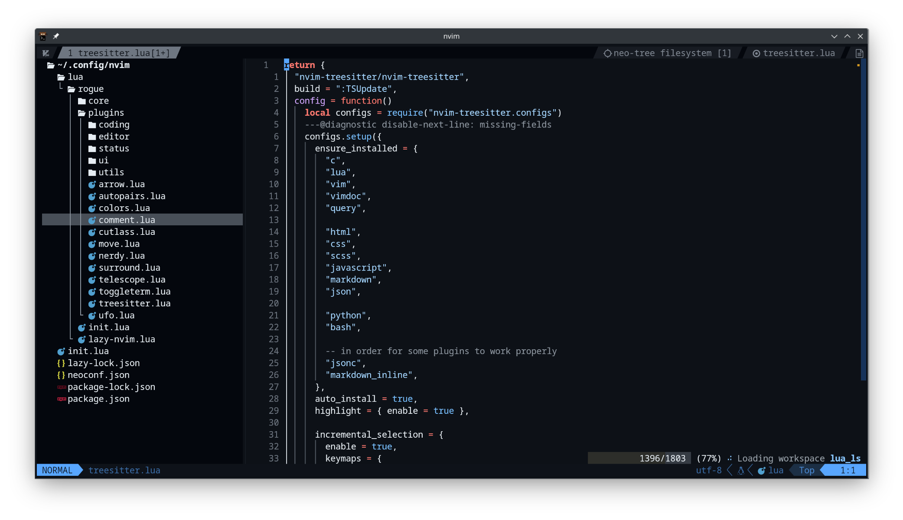
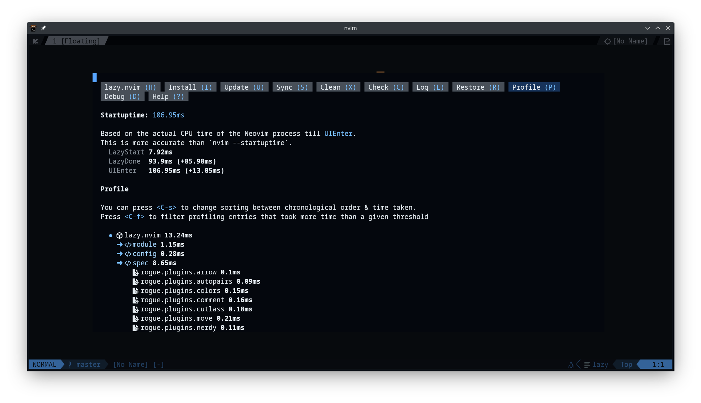
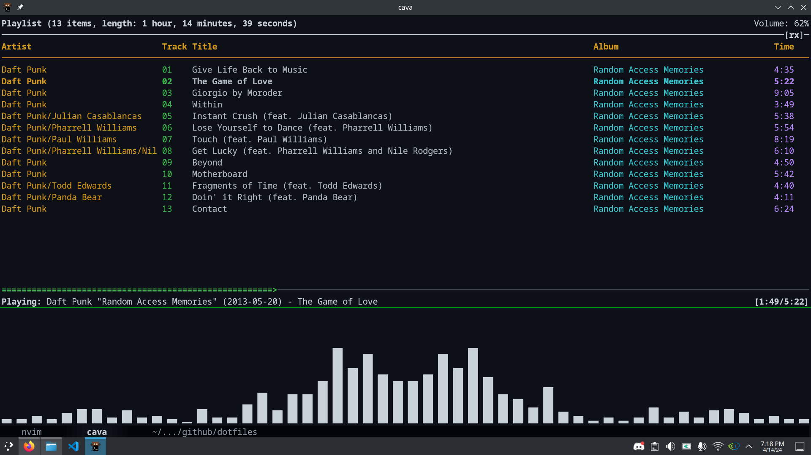

## my dotfiles nothing special

### Neovim config



#### lazy.nvim as my package manager coz I'm lazy :3



### ncmpcpp (still figuring out this stuff ^^)



## Setup

#### Packages

Install these packages using the linux distro native package manager

```
neovim kitty cava ncmpcpp mpd stow npm nodejs python3 pip lua luarocks
```

#### npm setup

Set installation path for global npm packages(so you wouldn't need to use sudo), and add the path to .bashrc

```
mkdir "${HOME}/.npm-packages"
npm config set prefix "${HOME}/.npm-packages"
echo 'export PATH=~/.npm-packages/bin:$PATH' >> ~/.bashrc
source ~/.bashrc
```

Also you may want to install these as well(please use pnpm it will save ya alot of time, no one should use npm)

```
npm i -g yarn pnpm
```

reminder to myself to make an install shellscript for this
