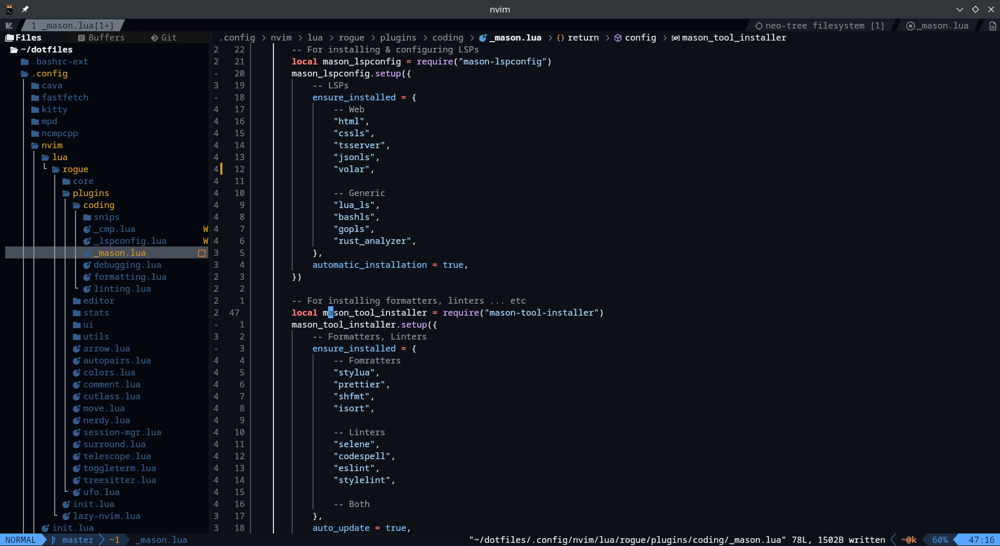

## my dotfiles nothing special

### Neovim config



#### Look at that sweet sweet startup time :p


## Setup

#### shellscript

clone the repo recursively using `git clone --recurse-submodules <GIT-REPO-URL>` into your home directory, if you want ranger devicons, and cd into the dotfiles directory, and then run setup shellscript file. oh yea, only works on fedora for now

```bash
bash setup.sh
```

#### manual

- clone the repo recursively using `git clone --recurse-submodules <GIT-REPO-URL>` into your home directory.

- Install [lazygit](https://github.com/jesseduffield/lazygit?tab=readme-ov-file#installation)

- install [glow](https://github.com/charmbracelet/glow?tab=readme-ov-file#installation)

- install theses packages(most likely available in the distro repo)

```
  neovim kitty fastfetch btop cava ncmpcpp mpd ranger lazygit stow npm nodejs python3 pip lua luarocks gloang rust
```

- install these npm packages(required by some neovim plugins)

```
  neovim yarn pnpm browser-sync vscode-langservers-extracted typescript typescript-language-server @vue/language-server @vue/typescript-plugin
```

- finally, run stow command(make sure you're in the dotfiles dir!)

```bash
stow .
```

- **done!**
